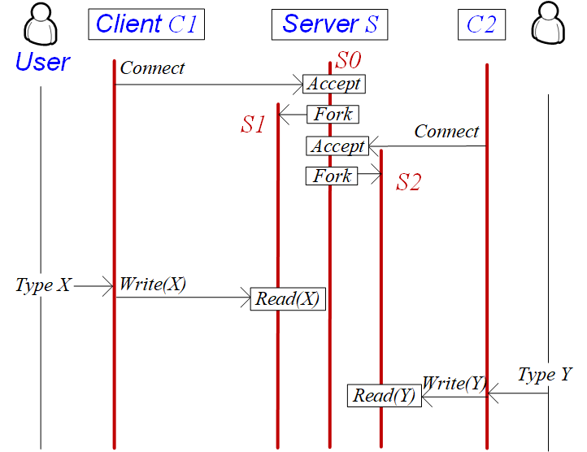
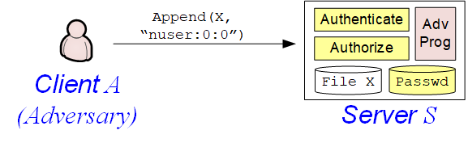

Build-a-server demo
===

This folder contains a multi-processing web server that is gradually built in a series of demos: noop, echo, web. Under echo, we consider one client, one blocking client, and two blocking clients.

When the multiprocessing (web) server is fully built, the following illustrtes how the server `S` handles two concurrent clients `C1` and `C2`. The server uses a primary process `S0` to handle incoming clients' connection requests, launches one child process `S1` to the read/write requests from the first client `C1` and another child process `S2` to handle the second client `C2`.

Secure server
===

